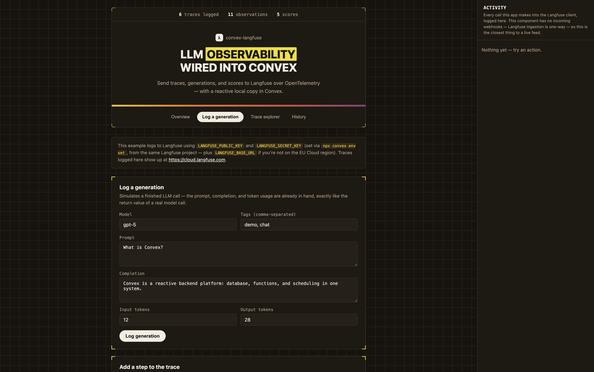

# convex-langfuse

**Send LLM traces, generations, and scores from your Convex app to Langfuse.** Reactive local queries, OpenTelemetry-native ingestion.

[](https://www.npmjs.com/package/convex-langfuse)
[](https://www.convex.dev/components/sholajegede/convex-langfuse)
[](https://www.npmjs.com/package/convex-langfuse)
[](./LICENSE)



```ts
const langfuse = new Langfuse(components.convexLangfuse, {
  publicKey: process.env.LANGFUSE_PUBLIC_KEY!,
  secretKey: process.env.LANGFUSE_SECRET_KEY!,
});

// Log a completed LLM call
const { traceId } = await langfuse.logGeneration(ctx, {
  name: "chat-completion",
  userId: "user_123",
  model: "gpt-5",
  input: prompt,
  output: completion,
  inputTokens: 120,
  outputTokens: 340,
});

// Attach a user rating or eval score to it
await langfuse.recordScore(ctx, { traceId, name: "user-rating", value: 1 });
```

## What this does

Most Langfuse integrations assume a long-lived Node process that can hold an OpenTelemetry span open for the duration of an LLM call. Convex actions are short, stateless, request/response functions — there's no "open a span, await a stream, close it later." This component is built for that shape: you call it once, with the finished input/output/timing/usage already in hand, and it does the rest.

Under the hood it exports a single completed [OpenTelemetry span](https://langfuse.com/integrations/native/opentelemetry) per call, using Langfuse's documented span attribute conventions (`langfuse.observation.*`, `langfuse.trace.*`) — no OpenTelemetry SDK dependency, just `fetch`. This matters more than it sounds: Langfuse's older `/api/public/ingestion` batch endpoint is **deprecated and sunsets on Langfuse Cloud on November 16, 2026**. Building against the OTLP endpoint from day one means this component doesn't need a rewrite in a few months.

Alongside the export, every trace, generation, and score is mirrored into Convex tables so you can query them reactively — build a live "recent generations" or "token usage" view without a separate call to Langfuse's API.

- **One-shot logging** — `logGeneration()` / `logSpan()` take a finished call and export it as a proper Langfuse trace + observation
- **Scoring** — `recordScore()` attaches an evaluation or user-rating score to any trace
- **Reactive local queries** — traces, observations, and scores are all queryable live from Convex
- **No SDK dependency** — talks to Langfuse's OTLP/HTTP and Scores REST endpoints directly over `fetch`

## Table of Contents

- [Install](#install)
- [Quick Start](#quick-start)
- [Usage](#usage)
- [Continuing a Trace](#continuing-a-trace)
- [API Reference](#api-reference)
- [Type Reference](#type-reference)
- [Database Schema](#database-schema)
- [Testing](#testing)
- [Example App](#example-app)
- [Limitations](#limitations)
- [Troubleshooting](#troubleshooting)
- [Contributing](#contributing)
- [Changelog](#changelog)

## Install

```bash
npm install convex-langfuse
```

**Requirements:** Convex v1.33.1 or later, Node.js 18+, a [Langfuse](https://langfuse.com) project (Cloud or self-hosted, OTel-compatible)

## Quick Start

Three steps to send traces from your Convex app to Langfuse.

### 1. Add the component

In `convex/convex.config.ts`:

```ts
import { defineApp } from "convex/server";
import convexLangfuse from "convex-langfuse/convex.config";

const app = defineApp();
app.use(convexLangfuse);

export default app;
```

### 2. Set environment variables

```bash
npx convex env set LANGFUSE_PUBLIC_KEY pk-lf-xxxxxxxxxxxx
npx convex env set LANGFUSE_SECRET_KEY sk-lf-xxxxxxxxxxxx
```

### 3. Initialize the client

In `convex/observability.ts`:

```ts
import { components } from "./_generated/api";
import { Langfuse } from "convex-langfuse";

export const langfuse = new Langfuse(components.convexLangfuse, {
  publicKey: process.env.LANGFUSE_PUBLIC_KEY!,
  secretKey: process.env.LANGFUSE_SECRET_KEY!,
  // baseUrl defaults to the EU Langfuse Cloud region — set it for US/JP/self-hosted
});
```

Import `langfuse` from this file in any Convex action that calls an LLM.

## Usage

### Log a generation

```ts
export const chat = action({
  args: { userId: v.string(), prompt: v.string() },
  handler: async (ctx, args) => {
    const completion = await callYourModel(args.prompt);

    const { traceId } = await langfuse.logGeneration(ctx, {
      name: "chat-completion",
      userId: args.userId,
      model: "gpt-5",
      input: args.prompt,
      output: completion,
      inputTokens: completion.usage.inputTokens,
      outputTokens: completion.usage.outputTokens,
    });

    return { completion, traceId };
  },
});
// Returns: { traceId, observationId }
```

### Log a non-LLM step

```ts
await langfuse.logSpan(ctx, {
  traceId,
  name: "vector-search",
  input: { query },
  output: { matches },
});
```

### Record a score

```ts
export const rate = action({
  args: { traceId: v.string(), value: v.number() },
  handler: async (ctx, args) => {
    await langfuse.recordScore(ctx, {
      traceId: args.traceId,
      name: "user-rating",
      value: args.value, // e.g. 1 for thumbs up, 0 for thumbs down
    });
    return null;
  },
});
```

### Read a trace reactively

```ts
export const getTrace = query({
  args: { traceId: v.string() },
  handler: async (ctx, args) => langfuse.getTrace(ctx, args),
});

export const getObservations = query({
  args: { traceId: v.string() },
  handler: async (ctx, args) => langfuse.listObservations(ctx, args),
});
```

## Continuing a Trace

Pass the `traceId` returned from the first call into subsequent `logGeneration()`/`logSpan()` calls to group multiple observations (a retrieval step, then a generation, then a tool call) under one trace in the Langfuse UI:

```ts
const { traceId } = await langfuse.logSpan(ctx, { name: "retrieve-context", ... });
await langfuse.logGeneration(ctx, { traceId, name: "generate-answer", ... });
```

## API Reference

| Method | Kind | Description |
| --- | --- | --- |
| `logGeneration(ctx, args)` | action | Exports a completed LLM call as a Langfuse generation |
| `logSpan(ctx, args)` | action | Exports a completed non-LLM step as a Langfuse span |
| `recordScore(ctx, args)` | action | Attaches an evaluation/rating score to a trace |
| `getTrace(ctx, args)` | query | Fetch one trace by id |
| `listTracesByUser(ctx, args)` | query | List a user's traces, newest first |
| `listTracesBySession(ctx, args)` | query | List a session's traces, newest first |
| `listObservations(ctx, args)` | query | List a trace's observations, oldest first |
| `listScores(ctx, args)` | query | List a trace's scores |
| `listRecentTraces(ctx, args?)` | query | Every trace, newest first, regardless of user/session — for a history view or dashboard |
| `getStats(ctx)` | query | Aggregate trace/observation/score counts for a small dashboard |

## Type Reference

```ts
type LogObservationArgs = {
  traceId?: string;       // omit to start a new trace
  traceName?: string;
  userId?: string;
  sessionId?: string;
  tags?: string[];
  release?: string;
  traceMetadata?: Record<string, unknown>;

  name: string;
  input?: unknown;
  output?: unknown;
  model?: string;
  inputTokens?: number;
  outputTokens?: number;
  level?: "DEBUG" | "DEFAULT" | "WARNING" | "ERROR";
  statusMessage?: string;
  metadata?: Record<string, unknown>;
  startTime?: number;      // ms epoch, defaults to now
  endTime?: number;        // ms epoch, defaults to startTime
};

type Trace = {
  traceId: string;
  name: string;
  userId?: string;
  sessionId?: string;
  tags?: string[];
  metadata?: string;
  release?: string;
};

type Observation = {
  observationId: string;
  traceId: string;
  type: "span" | "generation" | "event" | "embedding" | "agent" | "tool"
      | "chain" | "retriever" | "guardrail" | "evaluator";
  name: string;
  input?: string;
  output?: string;
  model?: string;
  inputTokens?: number;
  outputTokens?: number;
  level: "DEBUG" | "DEFAULT" | "WARNING" | "ERROR";
  statusMessage?: string;
  metadata?: string;
  startedAt: number;
  endedAt: number;
};

type Score = {
  scoreId: string;
  traceId: string;
  name: string;
  value: number;
  comment?: string;
};
```

## Database Schema

```ts
traces: {
  traceId, name, userId?, sessionId?, tags?, metadata?, release?,
  createdAt, updatedAt,
}

observations: {
  observationId, traceId, type, name, input?, output?, model?,
  inputTokens?, outputTokens?, level, statusMessage?, metadata?,
  startedAt, endedAt, createdAt,
}

scores: {
  scoreId, traceId, name, value, comment?, createdAt,
}
```

`listRecentTraces()` and `getStats()` read across these tables directly with a full scan — fine for a history view or small dashboard, not intended as a high-volume production query path.

## Testing

```bash
npm run test
```

Component logic is tested with [`convex-test`](https://www.npmjs.com/package/convex-test) in `src/component/lib.test.ts`. Import `convex-langfuse/test` in your own app to register this component's schema against your test instance.

## Example App

`example/` is a full Vite + React demo that exercises the entire component end to end against your own Langfuse account:

- **Log a generation** — simulate a finished chat completion (model, prompt, completion, token counts, tags) and export it as a Langfuse generation.
- **Continue the trace** — attach a non-LLM step (a retrieval, a tool call, a guardrail check) to the same trace via `logSpan()`.
- **Rate the response** — attach a 👍/👎 `recordScore()` call, with an optional comment.
- **Trace explorer** — look up any trace by id, or browse the traces recorded for a given user/session, all reactive.
- **History** — every trace ever recorded in the deployment, newest first, independent of the browser-local demo identity that resets on reload. Expand a trace to see its full generation/step/score detail, and hit **Replay this** to recreate the whole scenario as a brand-new trace live, without retyping anything — useful for anyone poking at the demo who wants to see the flow without filling out forms themselves.
- **Activity console** — a side-docked live log of every call this app makes into the Langfuse client. Since Langfuse ingestion is one-way (no webhooks call back into Convex), this is the closest thing to a live feed the example has.

Run it from the repo root:

```bash
npm install --legacy-peer-deps
npx convex env set LANGFUSE_PUBLIC_KEY pk-lf-xxxxxxxxxxxx
npx convex env set LANGFUSE_SECRET_KEY sk-lf-xxxxxxxxxxxx
npm run dev
```

`npm run dev` starts the Convex backend and the Vite frontend together — there's no need to `cd example` or run either one separately.

## Limitations

- No live/streaming spans — each call exports one already-finished observation. For a call you want to see "in progress," log it once it completes rather than trying to open and later close a span.
- Trace-level fields (`userId`, `sessionId`, `tags`, `metadata`) are attached to every span you log under that trace, per Langfuse's own OTel guidance for filterable trace attributes — there's no separate "create trace" call.
- This component does not vendor the Langfuse SDK or an OpenTelemetry SDK; it constructs minimal OTLP/HTTP JSON payloads directly, which keeps it dependency-free but means it only covers the attributes this README documents.

## Troubleshooting

**Nothing shows up in the Langfuse UI** — confirm `baseUrl` matches your project's region (EU, US, JP, HIPAA, or your self-hosted URL) and that the OTLP endpoint isn't blocked by a firewall between Convex and Langfuse.

**401 from Langfuse** — `publicKey`/`secretKey` are combined into a Basic auth header; confirm both are set and belong to the same project.

**Generation shows no cost/usage** — cost is computed by Langfuse from `inputTokens`/`outputTokens` and the model's pricing table; confirm `model` matches a model name Langfuse recognizes for your provider.

## Contributing

See [CONTRIBUTING.md](./CONTRIBUTING.md).

## Changelog

See [CHANGELOG.md](./CHANGELOG.md).
